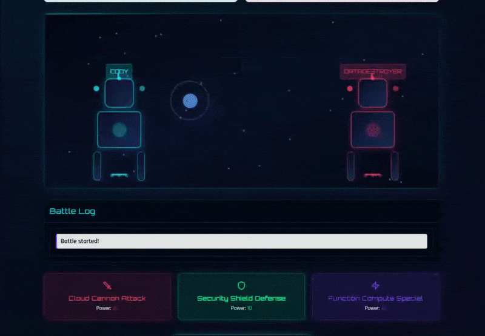
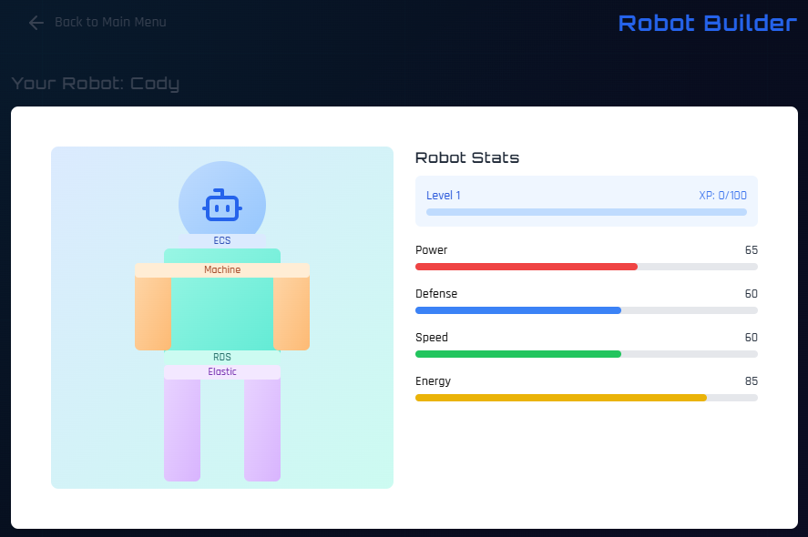
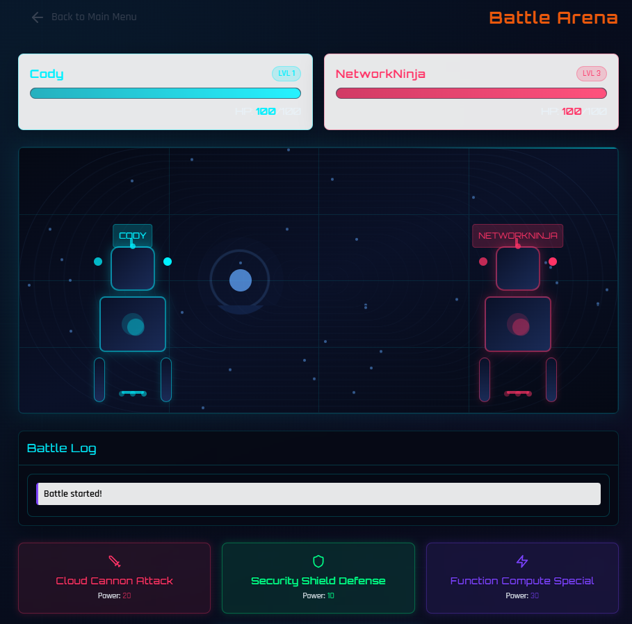
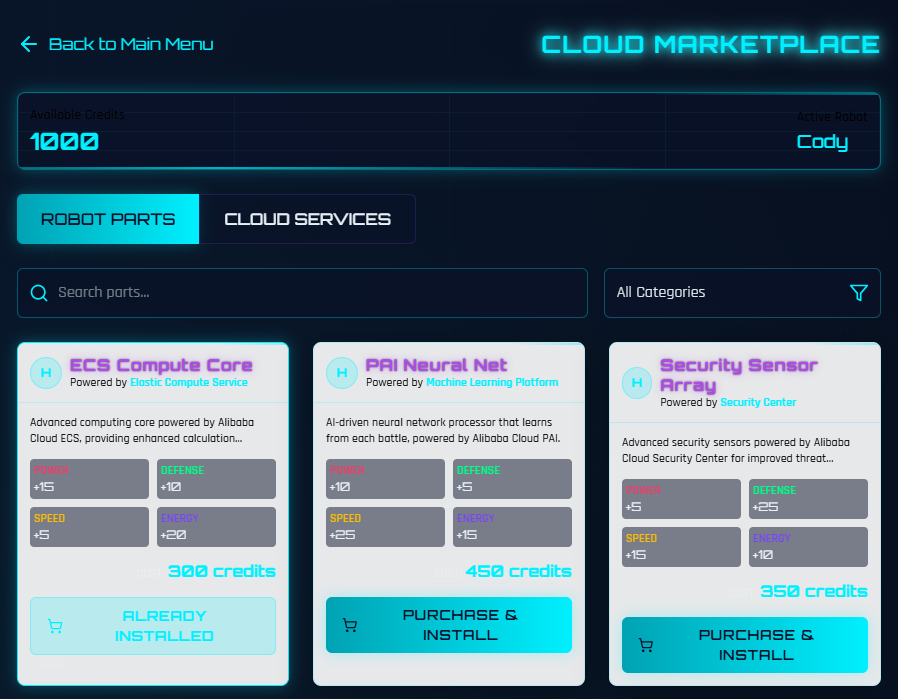
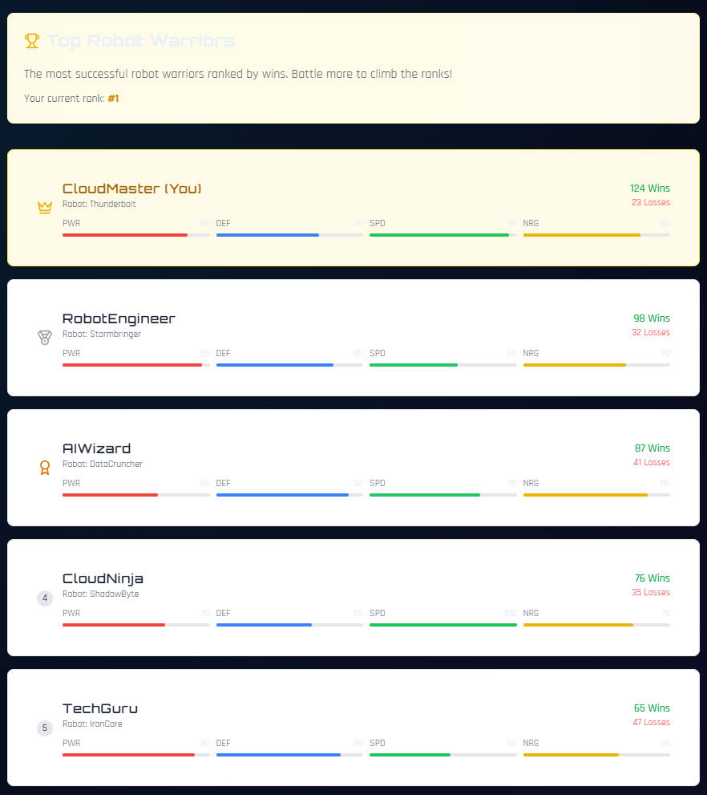

#  Cody's Cloud Arena

<div align="center">
  
  
  <p>
    <strong>Build, battle, and upgrade robots powered by Alibaba Cloud technologies!</strong>
  </p>
  
  <p>
    <a href="https://www.northstarcoding.com">
      
    </a>
    <a href="https://www.alibabacloud.com/">
      
    </a>
    <a href="https://reactjs.org/">
      
    </a>
    <a href="https://www.typescriptlang.org/">
      
    </a>
  </p>
</div>

## ✨ Features

<div align="center">
  <table>
    <tr>
      <td width="50%">
        <h3 align="center">🤖 Robot Builder</h3>
        
        <p align="center">Create and customize your robot with parts powered by Alibaba Cloud services</p>
      </td>
      <td width="50%">
        <h3 align="center">⚔️ Battle Arena</h3>
        
        <p align="center">Test your robot in cloud-driven battles against AI opponents</p>
      </td>
    </tr>
    <tr>
      <td width="50%">
        <h3 align="center">🛒 Cloud Marketplace</h3>
        
        <p align="center">Upgrade your robot with new parts from the Cloud Marketplace</p>
      </td>
      <td width="50%">
        <h3 align="center">🏆 Leaderboard</h3>
        
        <p align="center">Compete for the top spot on the global leaderboard</p>
      </td>
    </tr>
  </table>
</div>

## 🚀 Alibaba Cloud Integration

Cody's Cloud Arena is fully deployed on Alibaba Cloud, utilizing multiple services:

- **ECS (Elastic Compute Service)** - Hosts the game application
- **OSS (Object Storage Service)** - Stores game assets and resources
- **ApsaraDB for RDS** - Manages game data and player information
- **CDN** - Optimizes content delivery for global players
- **Function Compute** - Powers serverless backend functions

Each robot part in the game is powered by a different Alibaba Cloud service, providing both educational value about cloud technologies and engaging gameplay mechanics.

## 🎮 How to Play

1. **Create Your Robot**: Start by building a custom robot in the Robot Builder
2. **Add Cloud-Powered Parts**: Each part is powered by an Alibaba Cloud service
3. **Enter the Battle Arena**: Test your robot against AI opponents
4. **Earn Credits**: Win battles to earn credits for upgrades
5. **Upgrade Your Robot**: Purchase new parts from the Cloud Marketplace
6. **Climb the Leaderboard**: Compete for the top position

## 🛠️ Technology Stack

- **Frontend**: React, TypeScript, TailwindCSS
- **State Management**: React Context API
- **Animations**: CSS Animations, Tailwind Animations
- **Icons**: Lucide React
- **Build Tool**: Vite
- **Deployment**: Alibaba Cloud ECS, OSS, CDN

## 🔧 Development

### Prerequisites

- Node.js (v18+)
- npm or yarn

### Installation

```bash
# Clone the repository
git clone https://github.com/northstarcoding/codys-cloud-arena.git

# Navigate to the project directory
cd codys-cloud-arena

# Install dependencies
npm install

# Start the development server
npm run dev
```

### Building for Production

```bash
# Build the project
npm run build

# Preview the production build
npm run preview
```

## 🌐 Deployment

The game is deployed on Alibaba Cloud using the following services:

1. **ECS Instance**: Hosts the web application
2. **OSS Bucket**: Stores static assets
3. **CDN**: Distributes content globally
4. **RDS**: Manages game data
5. **Function Compute**: Handles serverless backend functions

## 📝 License

This project is licensed under the MIT License - see the [LICENSE](LICENSE) file for details.

## 👨‍💻 Author

**Ilya Belous** - [Northstar Coding](https://www.northstarcoding.com)

---

<div align="center">
  <p>
    <a href="https://www.alibabacloud.com/">
      
    </a>
    &nbsp;&nbsp;&nbsp;
    <a href="https://www.northstarcoding.com">
      
    </a>
  </p>
  <p>© 2025 Northstar Coding. All rights reserved.</p>
</div>
